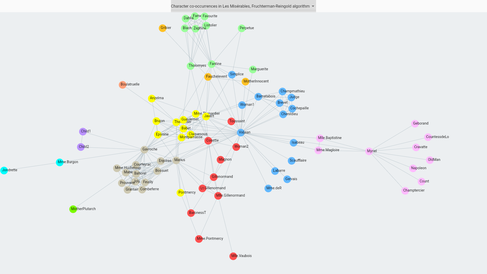

# graphs

This reposiory is home to my graph visualisation libraries.

If you are using Flutter and want an easy-to-use widget API to display graphs in your app, use [graph_display](./graph_display).

If you are not using Flutter, or you require more fine-grained control over how graphs are displayed in your app, use the algorithms and basic primitives provided by [graph_layout](./graph_layout).

